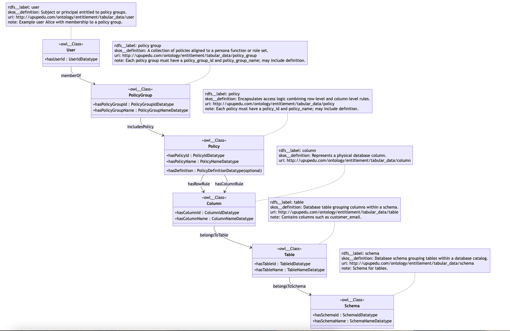

# Entitlement 

## Relational Database Schema Design

The entitlement schema is designed to provide granular, policy-driven access control for SQL databases, securing data at both the row level and column level.

At the core of the model are policies, which represent access rules. Policies can incorporate:
*   Row filter rules that define which rows a subject may see, based on schema, table, column, and value filters.
*   Column mask rules that specify how sensitive column values should be transformed or hidden before being presented.

Policies are bundled into policy groups, which represent higher-level personas or role sets. Users (or other subjects) are assigned to policy groups via entitlements, ensuring that each subject inherits the correct set of policies.

The schema also explicitly models the database schema, table, and column metadata, ensuring that every rule is traceable to the physical data structure it governs. Each relationship between a policy, rule, column, and table is captured, along with descriptive annotations, status flags, and effective dates, supporting both operational enforcement and governance review.

This design provides:
* 	Row-level security by filtering permissible data values per user or group.
* 	Column-level security by masking or redacting sensitive fields.
* 	Policy grouping for simplified administration and persona-based entitlements.
* 	Auditability and compliance support through explicit tracking of rules, assignments, and their lifecycle status.

By combining these features, the schema ensures that users can access only the data necessary for their role, thereby strengthening overall data protection and facilitating compliance with regulatory requirements.

# Ontology / Neo4j Schema Design

## OpenAI prompt
- Create a mermaid diagram showing the ontology, along with their relationships:

The **entitlement ontology** is designed to represent **fine-grained access control policies** in a graph model, enabling flexible reasoning, visualization, and governance. All entities are modeled as `:owl__Class` nodes with a **lowercase `rdfs__label`** and a **`skos__definition`** describing their semantics.  

---

## Core Concepts

- (:Policy) is a node, annotation properties {'rdfs__label': 'policy', 'skos__definition': 'Encapsulates access logic combining row-level and column-level rules.', 'uri': 'http://upupedu.com/ontology/entitlement/tabular_data/policy', 'note': 'Each policy must have a policy_id and policy_name; may include definition.'}
- (:PolicyGroup) is a node, annotation properties {'rdfs__label': 'policy group', 'skos__definition': 'A collection of policies aligned to a persona function or role set.', 'uri': 'http://upupedu.com/ontology/entitlement/tabular_data/policy_group', 'note': 'Each policy group must have a policy_group_id and policy_group_name; may include definition.'}
- (:Column) is a node, annotation properties {'rdfs__label': 'column', 'skos__definition': 'Represents a physical database column.', 'uri': 'http://upupedu.com/ontology/entitlement/tabular_data/column'}
- (:Table) is a node, annotation properties {'rdfs__label': 'table', 'skos__definition': 'Database table grouping columns within a schema.', 'uri': 'http://upupedu.com/ontology/entitlement/tabular_data/table', 'note': 'Contains columns such as customer_email.'}
- (:Schema) is a node, annotation properties {'rdfs__label': 'schema', 'skos__definition': 'Database schema grouping tables within a database catalog.', 'uri': 'http://upupedu.com/ontology/entitlement/tabular_data/schema', 'note': 'Schema for tables.'}
- (:User) is a node, annotation properties {'rdfs__label': 'user', 'skos__definition': 'Subject or principal entitled to policy groups.', 'uri': 'http://upupedu.com/ontology/entitlement/tabular_data/user', 'note': 'Example user Alice with membership to a policy group.'}

---

## Relationship and their properties
- (:Policy)-[:hasColumnRule]->(:Column)
- (:PolicyGroup)-[:includesPolicy]->(:Policy)
- (:Column)-[:belongsToTable]->(:Table)
- (:Table)-[:belongsToSchema]->(:Schema)
- (:User)-[:memberOf]->(:PolicyGroup) 
- [:hasRowRule] is a relationship, annotation properties  {'owl__maxQualifiedCardinality': 9999, 'rdfs__label': 'has row rule', 'owl__minQualifiedCardinality': 0, 'skos__definition': 'Policy includes row-level access condition that applies to a specific column.', 'uri': 'http://upupedu.com/ontology/entitlement/tabular_data/policy/hasRowRule/customer_email'}
- [:hasColumnRule] is a relationship, annotation properties  {'owl__maxQualifiedCardinality': 9999, 'rdfs__label': 'has column rule', 'owl__minQualifiedCardinality': 0, 'skos__definition': 'Policy includes column-level masking logic that applies to a specific column.', 'uri': 'http://upupedu.com/ontology/entitlement/tabular_data/policy/hasColumnRule/account_balance'}
- [:includesPolicy] is a relationship, annotation properties  {'owl__maxQualifiedCardinality': 9999, 'rdfs__label': 'includes policy', 'owl__minQualifiedCardinality': 0, 'skos__definition': 'Policy group bundles policies.', 'uri': 'http://upupedu.com/ontology/entitlement/tabular_data/policy_group/includesPolicy/policy'}
- [:belongsToTable] is a relationship, annotation properties  {'owl__maxQualifiedCardinality': 1, 'rdfs__label': 'belongs to table', 'owl__minQualifiedCardinality': 1, 'skos__definition': 'A column is always contained in exactly one table.', 'uri': 'http://upupedu.com/ontology/entitlement/tabular_data/belongsToTable'}
- [:belongsToSchema] is a relationship, annotation properties  {'owl__maxQualifiedCardinality': 1, 'rdfs__label': 'belongs to schema', 'owl__minQualifiedCardinality': 1, 'skos__definition': 'A table is always contained in exactly one schema.', 'uri': 'http://upupedu.com/ontology/entitlement/tabular_data/belongsToSchema'}
- [:memberOf] is a relationship, annotation properties  {'owl__maxQualifiedCardinality': 9999, 'rdfs__label': 'member of', 'owl__minQualifiedCardinality': 0, 'skos__definition': 'User inherits policies through group membership.', 'uri': 'http://upupedu.com/ontology/entitlement/tabular_data/user/alice/memberOf/policy_group'} 

Each relationship is annotated with a **`skos__definition`** to capture its semantics (e.g., “column mask rule applies to a specific column”).  

---

## Data Properties

- (:Table) has data property tableName with data type TableNameDatatype
- (:Schema) has data property schemaId with data type SchemaIdDatatype
- (:Schema) has data property schemaName with data type SchemaNameDatatype
- (:Policy) has data property policyId with data type PolicyIdDatatype
- (:Policy) has data property policyName with data type PolicyNameDatatype
- (:Policy) has data property definition with data type PolicyDefinitionDatatype
- (:PolicyGroup) has data property policyGroupId with data type PolicyGroupIdDatatype
- (:PolicyGroup) has data property policyGroupName with data type PolicyGroupNameDatatype
- (:Column) has data property columnId with data type ColumnIdDatatype
- (:Column) has data property columnName with data type ColumnNameDatatype
- (:Table) has data property tableId with data type TableIdDatatype 

## Benefits

- **Traceability**: Every rule directly links to the physical column and table it governs.  
- **Granularity**: Policies can be expressed at both row and column level.  
- **Flexibility**: Policy groups allow scalable assignment of multiple policies to multiple users.  
- **Semantics & reasoning**: `skos__definition` and `rdfs__label` ensure clear meaning, enabling reasoning engines and governance tooling to interpret access models.  
- **Audit & compliance**: Graph relationships and lifecycle properties (`status`, timestamps) make it possible to query, certify, and audit entitlements end-to-end.  

---
