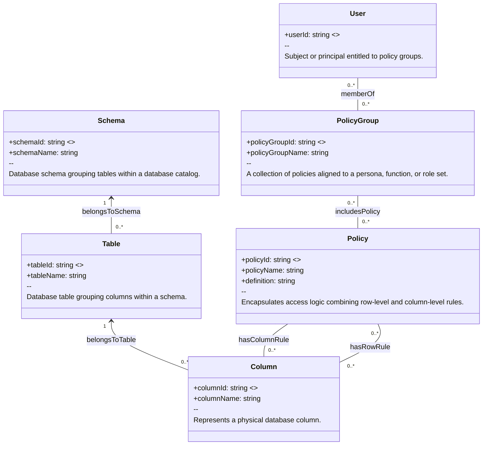

# Entitlement Schema Designed For relational Database

The entitlement schema is designed to provide granular, policy-driven access control for SQL databases, securing data at both the row level and column level.

At the core of the model are policies, which represent access rules. Policies can incorporate:
*   Row filter rules that define which rows a subject may see, based on schema, table, column, and value filters.
*   Column mask rules that specify how sensitive column values should be transformed or hidden before being presented.

Policies are bundled into policy groups, which represent higher-level personas or role sets. Users (or other subjects) are assigned to policy groups via entitlements, ensuring that each subject inherits the correct set of policies.

The schema also explicitly models the database schema, table, and column metadata, ensuring that every rule is traceable to the physical data structure it governs. Each relationship between a policy, rule, column, and table is captured, along with descriptive annotations, status flags, and effective dates, supporting both operational enforcement and governance review.

This design provides:
* 	Row-level security by filtering permissible data values per user or group.
* 	Column-level security by masking or redacting sensitive fields.
* 	Policy grouping for simplified administration and persona-based entitlements.
* 	Auditability and compliance support through explicit tracking of rules, assignments, and their lifecycle status.

By combining these features, the schema ensures that users can access only the data necessary for their role, thereby strengthening overall data protection and facilitating compliance with regulatory requirements.

# Entitlement Schema in format of Neo4j Graph Database

## Neo4j Node labels:

- (:Policy) is defined as:
Encapsulates access logic combining row-level and column-level rules. Each policy must have a policy_id and policy_name; may also include a definition.
- (:PolicyGroup) is defined as:
A collection of policies aligned to a persona, function, or role set. Each policy group must have a policy_group_id and policy_group_name; may also include a definition.
- (:Column) is defined as:
Represents a physical database column.
- (:Table) is defined as:
Database table grouping columns within a schema. Contains columns such as customer_email.
- (:Schema) is defined as:
Database schema grouping tables within a database catalog. Serves as a container for tables.
- (:User) is defined as:
Subject or principal entitled to policy groups. For example, a user like Alice can be a member of a policy group.
---

## Relationships
- (:Policy)-[:hasColumnRule]->(:Column)
- (:PolicyGroup)-[:includesPolicy]->(:Policy)
- (:Column)-[:belongsToTable]->(:Table)
- (:Table)-[:belongsToSchema]->(:Schema)
- (:User)-[:memberOf]->(:PolicyGroup) 

## Relationship types:
- [:hasRowRule] is defined as:
Policy includes row-level access conditions that apply to a specific column.
- [:hasColumnRule] is defined as:
Policy includes column-level masking logic that applies to a specific column.
- [:includesPolicy] is defined as:
Policy group bundles policies.
- [:belongsToTable] is defined as:
A column is always contained in exactly one table.
- [:belongsToSchema] is defined as:
A table is always contained in exactly one schema.
- [:memberOf] is defined as:
User inherits policies through group membership.
---

## Data Properties

- (:Table) has property tableName with data type string
- (:Schema) has property schemaId, which has unique value, with data type string
- (:Schema) has property schemaName with data type string
- (:Policy) has property policyId, which has unique value, with data type string
- (:Policy) has property policyName with data type string
- (:Policy) has property definition with data type string
- (:PolicyGroup) has property policyGroupId, which has unique value, with data type string
- (:PolicyGroup) has property policyGroupName with data type string
- (:Column) has property columnId, which has unique value, with data type string
- (:Column) has property columnName with data type string
- (:Table) has property tableId, which has unique value, with data type string
- (:User) has property userId, which has unique value, with data type string

## Benefits

- **Traceability**: Every rule directly links to the physical column and table it governs.  
- **Granularity**: Policies can be expressed at both row and column level.  
- **Flexibility**: Policy groups allow scalable assignment of multiple policies to multiple users.  
- **Semantics & reasoning**: `skos__definition` and `rdfs__label` ensure clear meaning, enabling reasoning engines and governance tooling to interpret access models.  
- **Audit & compliance**: Graph relationships and lifecycle properties (`status`, timestamps) make it possible to query, certify, and audit entitlements end-to-end.  

---

## Mermaid class diagram:

