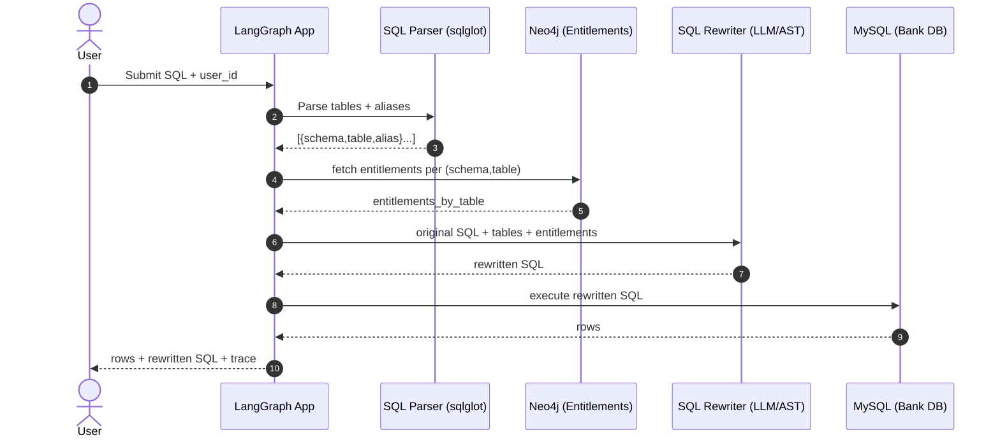
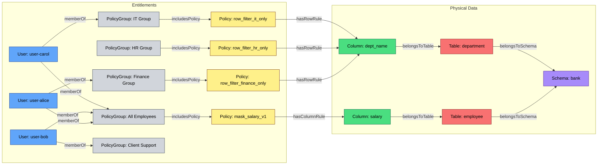
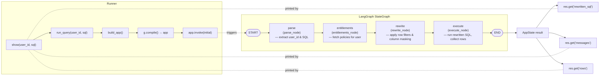

# Demo
You need to setup your own local environment properly in order to run the demo code.

## install required packages
```bash
pip install "langgraph>=0.2.33" "langchain>=0.3.0" "langchain-openai>=0.2.2"
pip install neo4j acryl-sqlglot mysql-connector-python jaydebeapi datahub
brew update
brew install openjdk@17
echo 'export PATH="/opt/homebrew/opt/openjdk@17/bin:$PATH"' >> ~/.zshrc
echo 'export CPPFLAGS="-I/opt/homebrew/opt/openjdk@17/include"' >> ~/.zshrc
echo 'export JAVA_HOME="/opt/homebrew/opt/openjdk@17/libexec/openjdk.jdk/Contents/Home"' >> ~/.zshrc
source ~/.zshrc
```

## download neo4j desktop
https://neo4j.com/download/neo4j-desktop/?edition=desktop&flavour=osx&release=2.0.5&offline=false


## download mysql jar
https://dev.mysql.com/downloads/connector
make sure you have jdk, which is needed for mysql jdbc connection

## Start (or restart) mysql server
```bash
# Apple Silicon default prefix
brew services restart mysql    # or: mysql@8.4 / mysql@5.7 if you installed a versioned formula
# Verify it’s running
brew services list
ps aux | grep mysqld
```

## load seed data to mysql database, if ask password, just click return key
```bash
mysql -h 127.0.0.1 -P 3306 -u root -p < demo/scripts/seed_mysql.sql
python -m demo.neo4j_data_loader
```

## connect to mysql database, if ask password, just click return key
```bash
mysql -h 127.0.0.1 -P 3306 -u root -p
```

#  Run demo
```bash
python -m demo.run_demo
```

## Sequence diagram



[entitlement-policy-graph-demo.html](demo/entitlement-policy-graph-demo.html)