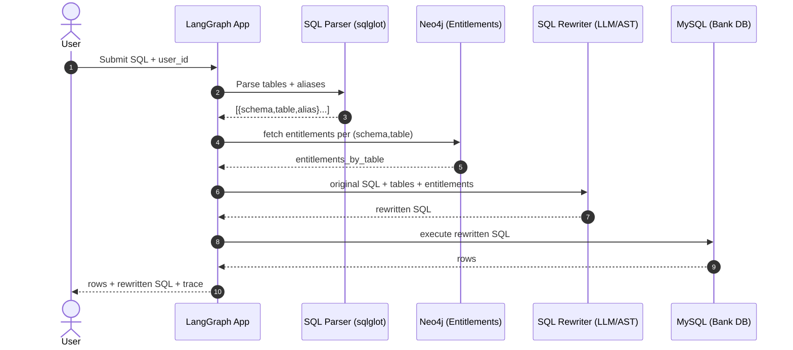
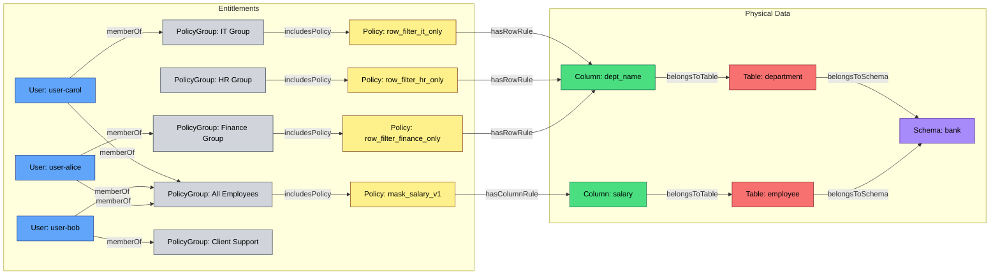

```mermaid
sequenceDiagram
  autonumber
  actor U as User
  participant App as LangGraph App
  participant P as SQL Parser (sqlglot)
  participant G as Neo4j (Entitlements)
  participant R as SQL Rewriter (LLM/AST)
  participant M as MySQL (Bank DB)

  U->>App: Submit SQL + user_id
  App->>P: Parse tables + aliases
  P-->>App: [{schema,table,alias}...]
  App->>G: fetch entitlements per (schema,table)
  G-->>App: entitlements_by_table
  App->>R: original SQL + tables + entitlements
  R-->>App: rewritten SQL
  App->>M: execute rewritten SQL
  M-->>App: rows
  App-->>U: rows + rewritten SQL + trace
```

```mermaid
flowchart LR
  subgraph Catalog["Physical Data"]
    S[Schema: bank]:::S
    T1[Table: employee]:::T
    T2[Table: department]:::T
    C1[Column: salary]:::C
    C2[Column: dept_name]:::C
    T1 -->|belongsToSchema| S
    T2 -->|belongsToSchema| S
    C1 -->|belongsToTable| T1
    C2 -->|belongsToTable| T2
  end

  subgraph Entitlements
    PGall[PolicyGroup: All Employees]:::G
    PGfin[PolicyGroup: Finance Group]:::G
    PGhr[PolicyGroup: HR Group]:::G
    PGit[PolicyGroup: IT Group]:::G
    PGcs[PolicyGroup: Client Support]:::G

    Pmask[Policy: mask_salary_v1]:::P
    Pfin[Policy: row_filter_finance_only]:::P
    Phr[Policy: row_filter_hr_only]:::P
    Pit[Policy: row_filter_it_only]:::P

    Ualice[User: user-alice]:::U
    Ubob[User: user-bob]:::U
    Ucarol[User: user-carol]:::U
  end

 %% Darker fills + explicit text colors
  classDef U fill:#60a5fa,stroke:#1e3a8a,stroke-width:1,color:#000000;
  classDef G fill:#d1d5db,stroke:#374151,stroke-width:1,color:#000000;
  classDef P fill:#fef08a,stroke:#78350f,stroke-width:1,color:#000000;
  classDef C fill:#4ade80,stroke:#065f46,stroke-width:1,color:#000000;
  classDef T fill:#f87171,stroke:#7f1d1d,stroke-width:1,color:#000000;
  classDef S fill:#a78bfa,stroke:#4c1d95,stroke-width:1,color:#000000;

  Ualice -->|memberOf| PGall
  Ualice -->|memberOf| PGfin
  Ubob -->|memberOf| PGall
  Ubob -->|memberOf| PGcs
  Ucarol -->|memberOf| PGall
  Ucarol -->|memberOf| PGit

  PGall -->|includesPolicy| Pmask
  PGfin -->|includesPolicy| Pfin
  PGhr -->|includesPolicy| Phr
  PGit -->|includesPolicy| Pit

  Pmask -->|hasColumnRule| C1
  Pfin  -->|hasRowRule| C2
  Phr   -->|hasRowRule| C2
  Pit   -->|hasRowRule| C2
```